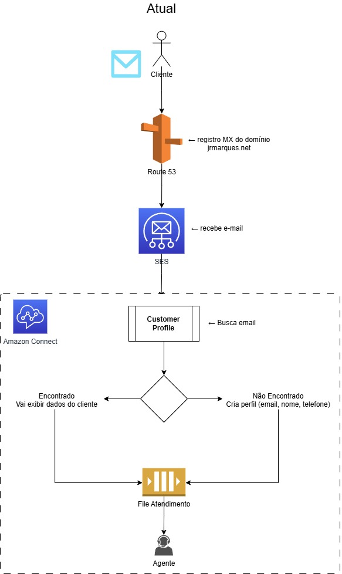

# 03 — Amazon Connect + SES + Customer Profiles + CCP

## 📋 Visão Geral

Canal de atendimento por e-mail utilizando Amazon Connect integrado ao Amazon SES. Mensagens enviadas para 'atendimento@jrmarques.net' são recebidas pelo Connect, processadas por um Contact Flow que identifica o cliente no Customer Profiles e encaminha o contato para uma fila de agentes. 

E isso o que ajuda no atendimento ???

Transforma o e-mail em uma tarefa inteligente antes mesmo de chegar no atendente. Em vez de o operador de Nível 1 perder tempo pulando de tela em tela (em "trocentos sistemas legados", o que acontece atualmente na empresa que trabalho (mas estamos mudando 😊), só para descobrir quem é o cliente e qual é o "BO", o Amazon Connect já joga o perfil e o histórico de casos mastigados na cara do Agente. Na prática, isso despenca o tempo atendimento N1 e aumenta a resolução logo no primeiro contato.

Para quem toca o suporte no dia a dia (N1 e N2), o ganho de eficiência é "show". O Nível 1 deixa de ser um mero "digitador ou repassador de BOs" e ganha autonomia para resolver o problema de cara, porque tem tudo na tela. 

E se precisar escalar para o Nível 2, nada de passar um e-mail "meia boca" ou algo "solto no ar": o caso vai completo e enriquecido. Assim, os times vão direto na causa raiz, sem retrabalho, sem achismo e principalmente sem encher o saco do cliente 😊.

---

## 🏗️ Arquitetura



---

## 🔄 Fluxo de Atendimento

1. Cliente envia e-mail para `atendimento@jrmarques.net`
2. Route 53 resolve o domínio via registro MX e entrega ao Amazon SES
3. SES recebe a mensagem e cria o contato no Amazon Connect
4. Connect inicia o Contact Flow com logging habilitado
5. O fluxo busca o cliente no Customer Profiles usando o e-mail do remetente (`$.CustomerEndpoint.Address`) como identificador (`_email`)
   - **Perfil encontrado (único)** → salva o `ProfileId` nos atributos do contato → associa o contato ao perfil → encaminha para a fila `Email_Teste`
   - **Múltiplos perfis encontrados** → associa ao primeiro perfil retornado → encaminha para a fila `Email_Teste`
   - **Perfil não encontrado** → cria novo perfil com o e-mail do remetente → salva o `ProfileId` → associa o contato ao perfil → encaminha para a fila `Email_Teste`
6. Agente recebe o contato no CCP com os dados do cliente visíveis

---

## 🛠️ Serviços AWS Utilizados

| Serviço | Função |
|---|---|
| Amazon Route 53 | Registro MX do domínio `jrmarques.net` apontando para o SES |
| Amazon SES | Recebimento de e-mails e entrega ao Amazon Connect |
| Amazon Connect | Contact Flow, roteamento e fila de atendimento |
| Amazon Connect Customer Profiles | Identificação, criação e associação do perfil do cliente |
| CCP (Contact Control Panel) | Interface do agente para atendimento |

---

## ⚙️ Contact Flow — Detalhes Técnicos

**Nome:** `03-connect-email-ses-custprofile-ccp`  
**Arquivo:** `contact-flows/03-connect-email-ses-custprofile-ccp.json`  
**Status:** Published

### Ações do fluxo (em ordem de execução)

| Passo | Tipo | Descrição |
|---|---|---|
| 1 | `UpdateFlowLoggingBehavior` | Habilita logging do fluxo no CloudWatch |
| 2 | `GetCustomerProfile` | Busca perfil pelo e-mail do remetente (`_email`) — retorna `EmailAddress`, `FirstName`, `LastName`, `PhoneNumber` |
| 3a | `UpdateContactAttributes` | (perfil encontrado) Salva `ProfileId` no atributo `udClienteProfileId` |
| 3b | `CreateCustomerProfile` | (perfil não encontrado) Cria perfil com o e-mail do remetente |
| 4 | `AssociateContactToCustomerProfile` | Associa o `ContactId` ao `ProfileId` no Customer Profiles |
| 5 | `UpdateContactTargetQueue` | Define a fila de destino: `03-connect-email-ses-custprofile-ccp` |
| 6 | `TransferContactToQueue` | Transfere o contato para a fila |

### Tratamento de erros

- Perfil não encontrado (`NoneFoundError`) → cria perfil automaticamente
- Múltiplos perfis (`MultipleFoundError`) → associa ao perfil já existente e encaminha
- Qualquer erro crítico → `DisconnectParticipant` (encerra o contato)

---

## 📁 Estrutura de Arquivos

```
03-connect-email-ses-custprofile-ccp/
├── README.md
├── contact-flows/
│   └── 03-connect-email-ses-custprofile-ccp.json
└── docs/
    ├── descricao.md
    └── images/
        └── 03-email-ses-custprofile-ccp.jpg
```

---

## 🔑 Conceitos Demonstrados

- Integração nativa **SES → Amazon Connect** para canal de e-mail sem código adicional
- Uso do **Customer Profiles** com identificador `_email` para busca automática do cliente
- Criação automática de perfil quando o cliente não existe na base
- Associação do `ContactId` ao `ProfileId` para histórico de atendimentos
- Atributo de contato customizado (`udClienteProfileId`) para rastreabilidade
- Roteamento por fila (`Email_Teste`) com tratamento de erros em cada etapa
- Logging habilitado via CloudWatch para observabilidade do fluxo

---

## 📝 Status

🔄 Em andamento — Contact Flow publicado e funcional com identificação e criação de perfil no Customer Profiles
