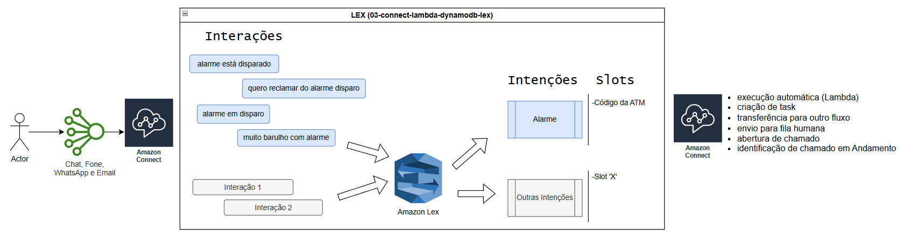

# 03 — Amazon Connect + Lambda + DynamoDB + Lex

## 📋 Visão Geral

Evolução do fluxo básico: o Amazon Lex identifica a intenção do cliente, a Lambda consulta o DynamoDB com os dados do cliente (identificado pelo número da ATM fornecido pelo cliente) e o Connect personaliza o atendimento com base nas informações retornadas — tudo antes de o cliente falar com um agente.

Detalhes de fila, perfil de roteamento, usuarios, etc já foram citado no "01-connect-basico-lex".

---

## 🏗️ Arquitetura

Seguindo nos moldes do exemplo anterior, aqui uso mesmo fluxo Principal, porém direcionado para fila de Incidentes (que trata problemas físicos nas ATMs).



```

---
Detalhes:
Cliente Chama Chat da Empresa
     ↓
Amazon Connect (Contact Flow)
     ↓
Amazon Lex V1 — identifica intenção
  └── Intenção: Alarme
     ↓
Invoke AWS Lambda (passa intenção + Código da ATM)
     ↓
Lambda consulta DynamoDB (busca por esse código)
     ↓
Retorna: Endereço, Estabelecimento e que já possui Chamado Em Andamento
     ↓
Connect usa atributos para personalizar resposta
     ↓
"Olá, João! Já estamos cientes do ocorrido e este ATM já possui um chamado em andamento para tratativa (Número: 123456). Pedimos desculpas pelo transtorno causado. Nossa equipe está atuando para que o problema seja solucionado o mais breve possível."
     ↓
Encerramento do fluxo

*esse é só um exemplo, o fluxo poderia ter uma chamada POST para outro sistema que faria a verificação e o desligamento do alarme. Enfim, são inumeras possibilidades, coloquei desenho de arq acima:
     -execução automática (Lambda)
     -criação de task
     -transferência para outro fluxo
     -envio para fila humana
     -abertura de chamado
     -identificação de chamado em Andamento
```

---

## 🛠️ Serviços AWS Utilizados

| Serviço | Função |
|---|---|
| Amazon Connect | Plataforma de contact center, gerencia o fluxo de chamadas |
| Amazon Lex | Identificação de intenção do cliente (NLU) |
| AWS Lambda | Consulta DynamoDB e retorna dados formatados para o Connect |
| Amazon DynamoDB | Base de dados de clientes (chave: número de telefone) |
| Amazon CloudWatch | Logs e monitoramento da Lambda |

---

## 📁 Estrutura de Arquivos

```
03-connect-lambda-dynamodb-lex/
├── README.md
├── diagrama-arquitetura.png
├── contact-flows/
│   └── fluxo-principal.json          ← exportado do Connect
├── lambda/
│   └── consulta-cliente-lex/
│       ├── index.js
│       ├── package.json
│       └── README.md
└── docs/
    └── descricao.md
```

---

## 🔑 Conceitos Demonstrados

- Combinação de **Lex + Lambda** dentro do mesmo Contact Flow
- Bloco **Get Customer Input** (Lex) seguido de **Invoke Lambda**
- Passagem da intenção identificada pelo Lex como parâmetro para a Lambda
- Uso de `$.Attributes` e `$.CustomerEndpoint.Address` no Contact Flow
- Retorno de múltiplos atributos da Lambda para uso no fluxo
- Roteamento condicional baseado em intenção **e** dados do cliente
- Tratamento de fallback: cliente não encontrado, intenção não reconhecida

---

## 📝 Status

🔄 Em andamento
