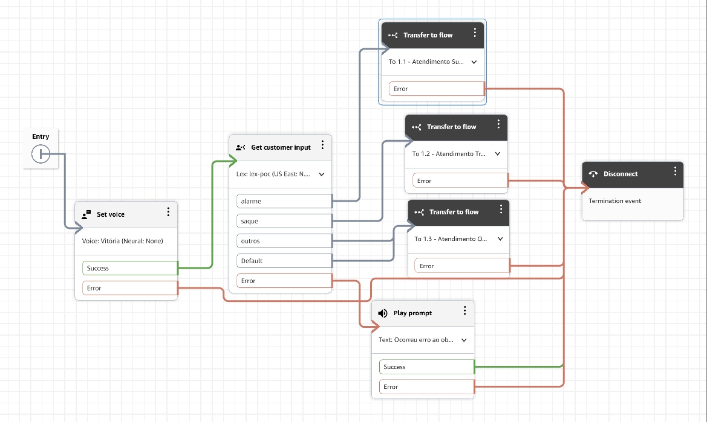
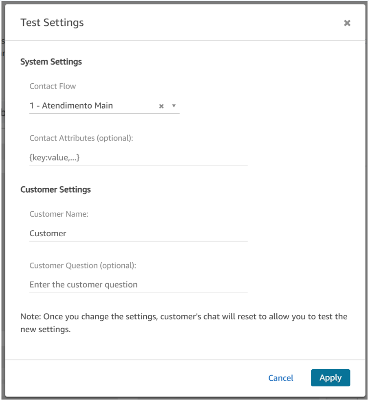
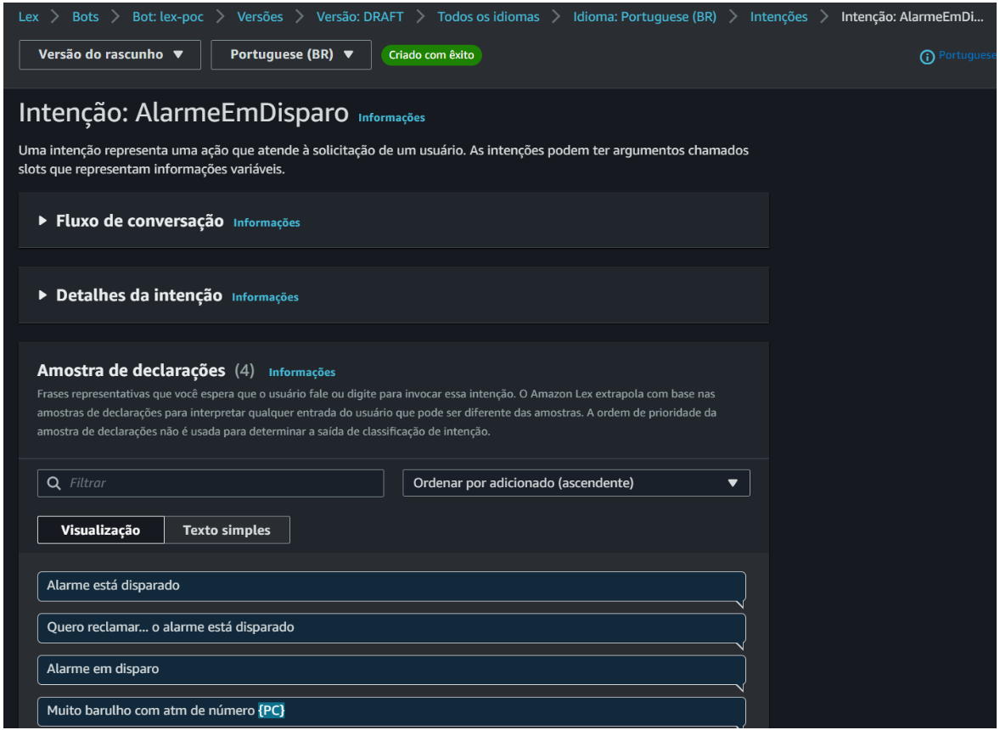
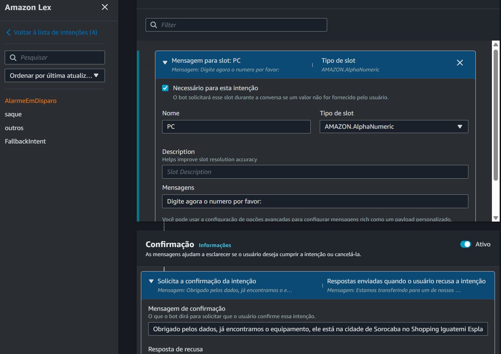
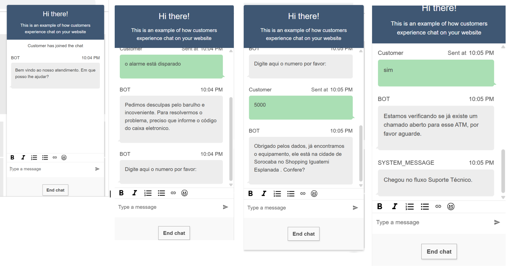
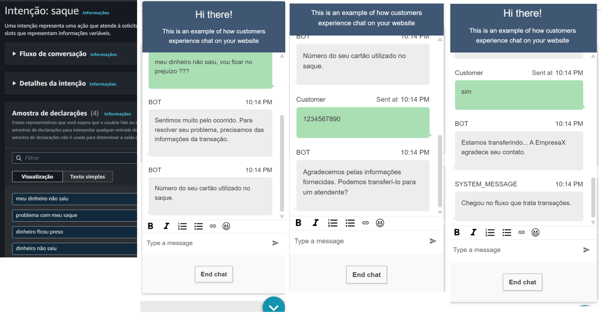
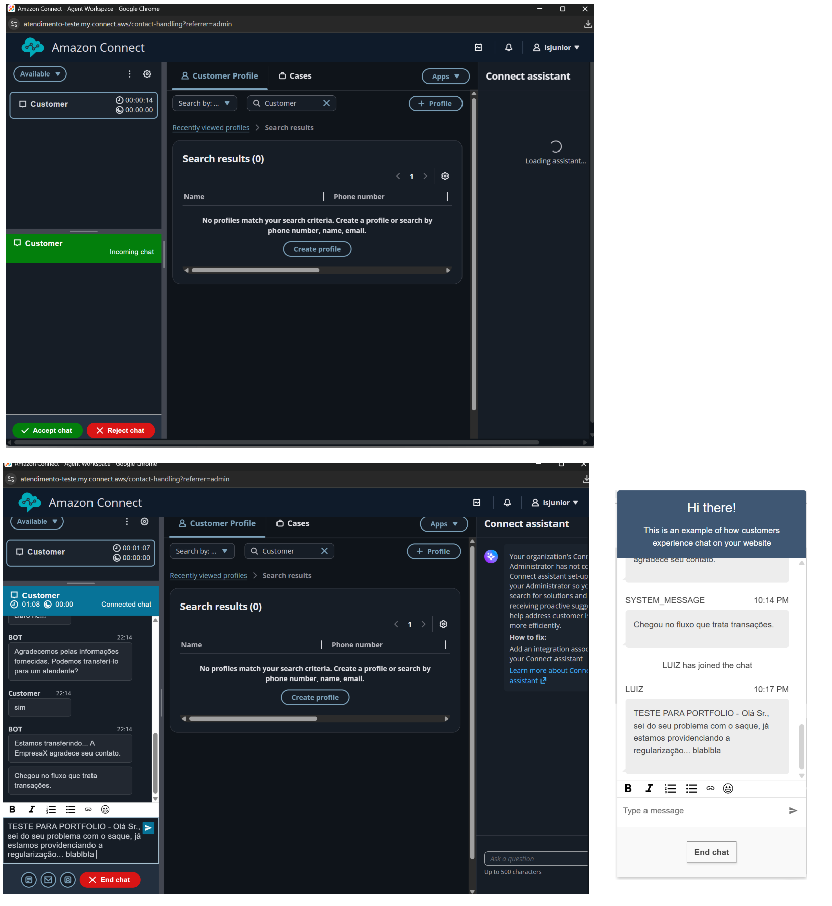

# 05 - Amazon Connect + Lex MultiFlow Routing

## 📌 Objetivo

Este projeto demonstra fluxo de atendimento inteligente utilizando Amazon Connect e Amazon Lex para roteamento automático de contatos baseado em intents e slots capturados pelo bot. (aqui... ao invés de fluxo poderia ser um Module). A solução identifica o tipo de problema informado pelo cliente e encaminha automaticamente para o fluxo e fila corretos. 

O cliente entra em contato com a central de atendimento informando um problema relacionado a:
- Reclamação de saque
- Alarme disparado
- Outros problemas
Sem digitação de números no telefone (DTMF), apenas fala ou escreve e o Lex entende o contexto do que foi falado ou digitado e já direciona para fila correta.

---

# 🏗️ Arquitetura da Solução

Fluxo principal da aplicação:

```text
Cliente
   ↓
Amazon Connect
   ↓
1 - Atendimento Main
   ↓
Amazon Lex V2 (lex-poc)
   ↓
Captura Intent + Slots
   ↓
Roteamento Inteligente
   ├── Reclamação de saque
   │      ↓
   │  1.2 - Atendimento Transacoes
   │      ↓
   │  Queue Transacoes
   │
   ├── Alarme disparado
   │      ↓
   │  1.1 - Atendimento Suporte Técnico
   │      ↓
   │  Queue Suporte Técnico
   │
   └── Outros problemas
          ↓
      1.3 - Atendimento Outros Problemas
          ↓
      Queue Outros
```

---
# ☁️ Fluxos



Ver prints dos demais fluxos em: [Acessar pasta de imagens](./images)


---

# ☁️ Evidencias do Funcionamento

Start com Fluxo Principal




Dados Lex Intenções: 



Dados Lex Slots: 




Teste com fluxo reclamação de Alarme:




Teste com fluxo reclamação de Saque:



Finalmente o ATENDIMENTO




---

---

# ☁️ Serviços AWS Utilizados

* Amazon Connect
* Amazon Lex V2
* Contact Flows
* Queues
* Routing Profiles

---

# 🤖 Bot Amazon Lex

## Nome do Bot

```text
lex-poc
```

---

# 🧠 Intents Implementadas

| Intent          | Objetivo                          | Direcionamento        |
| --------------- | --------------------------------- | --------------------- |
| saque           | Reclamação de saque não realizado | Queue Transacoes      |
| AlarmeEmDisparo | Problemas técnicos e alarmes      | Queue Suporte Técnico |
| FallbackIntent  | Casos não identificados           | Queue Outros          |

---

# 🔀 Contact Flows

| Fluxo                            | Objetivo                           |
| -------------------------------- | ---------------------------------- |
| 1-atendimento-main               | Fluxo principal com integração Lex |
| 1.1-atendimento-suporte-tecnico  | Atendimento técnico e alarmes      |
| 1.2-atendimento-transacoes       | Problemas financeiros e saque      |
| 1.3-atendimento-outros-problemas | Casos genéricos e fallback         |

---

0